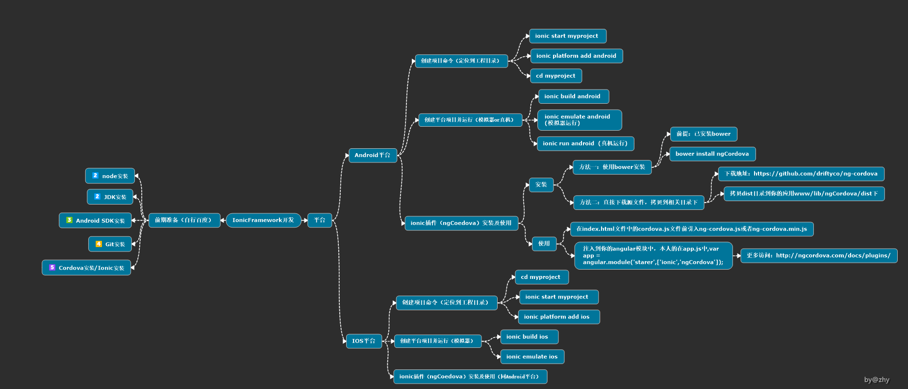

### IonicFramework Web移动端混合开发

### 为Web移动端混合开发-IonicFramework安利的号外
> 前期准备：
  * JDK 
    1. 下载地址     http://www.oracle.com/technetwork/java/javase/downloads/index.html
    2. 安装好之后环境变量配置:  
       新建系统变量JAVA_HOME 和CLASSPATH  
       变量名：JAVA_HOME  
       变量值：C:Program FilesJavajdk1.7.0  
       变量名：CLASSPATH  
       变量值：.;%JAVA_HOME%libdt.jar;%JAVA_HOME%libtools.jar;  
       变量名：Path  
       变量值：%JAVA_HOME%bin;%JAVA_HOME%jrebin;         
  * Android SDK  
    (参考该文章：http://www.cnblogs.com/zoupeiyang/p/4034517.html)
  * git  
    中间选择按照命令行来安装,会直接给你配置好环境变量.
  * nodejs 以及 npm  
    下载地址(https://nodejs.org/)  
    nodejs 安装简单,直接, 下一步下一步,然后完事.  
    cmd 测试: 输入  npm -v   和  node -v     结果如下说明成功.
  * Apache ant
    1. 下载地址(http://ant.apache.org/bindownload.cgi)  
    2. 安装: 下载压缩包后,解压到硬盘下的某一个目录(随便你)  
    3. 配置环境目录:  
    ANT_HOMEG:adt-bundle-windows-x86_64-20131030apache-ant-1.9.4  
    CLASSPATH;%ANT_HOME%lib;  
    PATH  ;%ANT_HOME%bin;  

### 插件ngCordova调用nativeAPI---Camera  
> 参数解析：  
  **imageData**：根据cameraOptions的设定值，为Base64编码的图像数据或图像文件的URI。（字符串类型）  
  **message**：设备本地代码提供的错误信息。（字符串类型）  
  **quality**：存储图像的质量，范围是[0,100]。（数字类型）  
  **destinationType**：选择返回数据的格式。通过navigator.camera.DestinationType进行定义。（数字类型）  
  
     Camera.DestinationType = { 
        DATA_URL : 0,   //返回Base64编码字符串的图像数据 
        FILE_URI : 1    //返回图像文件的URI 
     }  
     
  **sourceType**：设定图片来源。通过nagivator.camera.PictureSourceType进行定义。（数字类型）  
  
    Camera.PictureSourceType = { 
        PHOTOLIBRARY : 0, 
        CAMERA : 1, 
        SAVEDPHOTOALBUM : 2 
    }  
    
  **allowEdit**：在选择图片进行操作之前允许对其进行简单编辑。（布尔类型）  
  **EncodingType**：选择返回图像文件的编码方式，通过navigator.camera.EncodingType进行定义。（数字类型）  
    
    Camera.EncodingType = { 
        JPEG : 0,       // 返回JPEG格式图片 
        PNG : 1         // 返回PNG格式图片 
    };  
    
  **targetWidth**：以像素为单位的图像缩放宽度，必须和targetHeight同时使用。相应的宽高比保持不变。（数字类型）  
  **targetHeight**：以像素为单位的图像缩放高度，必须和targetWidth同时使用。相应的宽高比保持不变。（数字类型）
